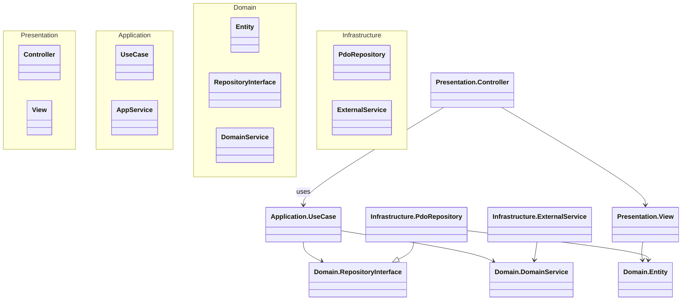
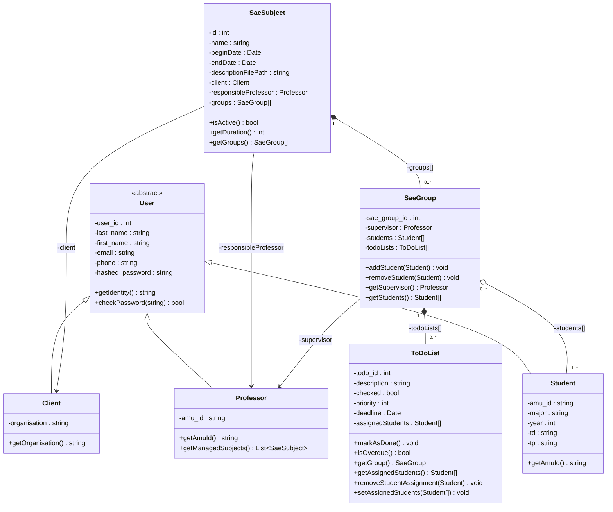
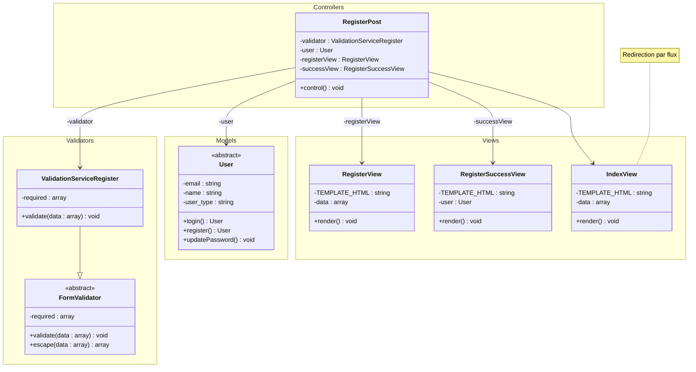

# SAE Manager

## **1. Analyse des Besoins & Spécifications**
### **a. Besoins du Client (Pages 6-7)**  
- **Utilisateurs & Rôles** : Étudiants, Responsables de SAE, Enseignants/Clients, Administrateurs.  
- **Fonctionnalités Clés** :  
  - Gestion simplifiée des évaluations/compétences (notes, commentaires sur les livrables).  
  - Suivi des livrables (lien vers Ametice, tri par groupe SAE/type de livrable).  
  - Suivi des SAE (tableau de bord Kanban/to-do list, calendrier des échéances).  
  - Notifications automatisées (push + email, 3 jours avant les échéances).  
  - Authentification simple (login/mot de passe) avec option double auth plus tard.  
- **UI/UX** : Interface simple, épurée, respectant la charte graphique de l'IUT.  

### **b. Exigences Académiques (Pages 1-5)**  
- **Architecture** : Clean Architecture (Domain, Application, Infrastructure, Presentation), utilisation de PDO pour les opérations CRUD, pagination.  
- **Sécurité** : Conformité au Top 10 OWASP.  
- **Qualité** : Accessibilité, responsive design, bonnes pratiques de développement (commentaires, validation W3C, optimisation).  
- **Livraisons** : Maquettes Figma, code GitHub, documentation, présentation orale.

## **2. Plan de Projet (Approche Itérative)**
Le client souhaite un développement itératif. On priorise un **MVP (Minimum Viable Product)** puis des itérations progressives.

| **Phase**       | **Objectifs**                                                                 | **Livraison**                                  |
|------------------|-------------------------------------------------------------------------------|-----------------------------------------------|
| **1. Conception** | - Réaliser des maquettes Figma pour tous les rôles. - Définir la base de données (tables : utilisateurs, SAE, livrables, évaluations, notifications). | Maquettes Figma, schéma de base de données.    |
| **2. Développement MVP** | - Authentification (inscription, connexion, mot de passe oublié). - Gestion basique des SAE (création, visualisation). - Téléchargement/liens des livrables. - Calendrier des échéances. | Code fonctionnel (Clean Architecture), base de données opérationnelle. |
| **3. Itération 1** | - Système de notation/évaluation (interface pour les enseignants). - Notifications basiques (email). | Fonctionnalités d’évaluation, module de notification. |
| **4. Itération 2** | - Tableau de bord Kanban pour le suivi des SAE. - Intégration de notifications push. - Amélioration de l’UI (charte IUT). | Dashboard dynamique, notifications push.       |
| **5. Tests & Validation** | - Tests unitaires (PHPUnit), tests d’accessibilité, vérification OWASP. - Correction des bugs. | Rapport de test, version stable.               |
| **6. Déploiement & Documentation** | - Hébergement du site (accès public). - Documentation (PHPDoc, guide utilisateur). - Préparation de la présentation orale. | Site en ligne, documentation complète.         |

## **3. Technologies Recommandées**
- **Frontend** : HTML5, CSS3 (responsive), JavaScript (pour les interactions).  
- **Backend** : PHP (framework minimaliste ou vanilla, adoptant les principes de Clean Architecture).  
- **Base de Données** : MySQL (avec PDO pour les requêtes).  
- **Outils** :  
  - Figma (maquettes).  
  - Git (versionnement).  
  - PHPUnit (tests unitaires).  
  - Cron Jobs (planification des notifications).  

## **4. Points Critiques à Respecter**
- **Sécurité** : Valider les entrées utilisateur, utiliser des mots de passe hashés, protéger contre les failles courantes (XSS, injection SQL).  
- **Accessibilité** : Utiliser des balises sémantiques, tester avec des outils comme Wave ou Axe.  
- **Performance** : Optimiser les images, minifier le CSS, utiliser le caching.  
- **Respect des Délais** : Planifier les réunions futures (page 7) pour valider les itérations.  

## **5. Livrables Attendus**
- URL du site web.  
- URL du dépôt Git.  
- Maquettes Figma partagées.  
- Identifiants de connexion (site/base de données).  
- Liste des sources utilisées (y compris les IA).  
- Présentation orale (démonstration du projet).  

## Clean Architecture Layers
The project is structured according to Clean Architecture principles, ensuring a clear separation of concerns, testability, and maintainability.

### 1. Domain Layer
- **Core Business Logic**: Contains entities, value objects, and domain services that encapsulate the fundamental business rules. This layer is independent of any frameworks or databases.
- **Entities**: `App\Domain\User\User`, `App\Domain\User\Student`, `App\Domain\User\Professor`, `App\Domain\User\Client`, `App\Domain\SAE\Sae`, `App\Domain\SAE\SaeGroup`, `App\Domain\ToDoList\ToDoList`, `App\Domain\Auth\Token`.
- **Interfaces for Repositories**: Define contracts for data persistence, such as `App\Domain\User\UserRepositoryInterface`, `App\Domain\SAE\SaeRepositoryInterface`, `App\Domain\SAE\SaeGroupRepositoryInterface`, `App\Domain\ToDoList\ToDoListRepositoryInterface`, `App\Domain\Auth\TokenRepositoryInterface`.

### 2. Application Layer
- **Use Cases (Interactors)**: Orchestrates the flow of data to and from the Domain layer. Each use case represents a specific application feature and depends only on the Domain layer.
- **Use Cases Examples**: `App\Application\User\LoginUserUseCase`, `App\Application\SAE\CreateSaeUseCase`, `App\Application\Email\AttributionMailer` (acting as an application service for sending emails).

### 3. Infrastructure Layer
- **External Concerns**: Handles external details such as database access, file system operations, and external APIs. This layer implements the interfaces defined in the Domain layer.
- **Repository Implementations**: `App\Infrastructure\User\Repository\PdoUserRepository`, `App\Infrastructure\SAE\Repository\PdoSaeRepository`, `App\Infrastructure\SAE\Repository\PdoSaeGroupRepository`, `App\Infrastructure\ToDoList\Repository\PdoToDoListRepository`, `App\Infrastructure\Auth\PdoTokenRepository`.
- **External Services**: `App\Infrastructure\FileService`, `App\Infrastructure\TokenService` (now coordinating repository operations).

### 4. Presentation Layer
- **User Interface**: Consists of controllers and views that interact with the user. Controllers receive user input, orchestrate the execution of use cases, and select views for rendering. Views display data to the user.
- **Controllers**: `App\Controllers\User\Login`, `App\Controllers\Dashboard\DashboardController`, etc.
- **Views**: `Views\User\LoginView`, `Views\Dashboard\DashboardView`, etc.

## Diagramme UML

[Diagramme de classe du projet](interactive-uml.html)

## Tableau des cas d'utilisations

| | Client  | Student | Teacher | New customer |
|-|-|-|-|-|
| Accès aux SAE | ✅ | ✅ | ✅ | ❌ |
| Contacter les membres | ✅ | ✅ | ✅ | ❌ |
| Suivre Progression | ✅ | ✅ | ✅  | ❌ |
| Attribuer SAE | ❌ | ❌ | ✅ | ❌ |
| Créer SAE |  ❌ | ❌ | ✅ | ❌ |
| Authentification | ❌ | ❌ | ❌ | ✅ |

### Diagramme de classes simplifié reflétant la Clean Architecture :

## Diagrammes de classes (anciens, à des fins historiques)
### Diagramme de classes minimale représentatif du projet. (Refléte les Entités du Domain) :

### Représentation simplifiée du MVC autour de la classe User :

